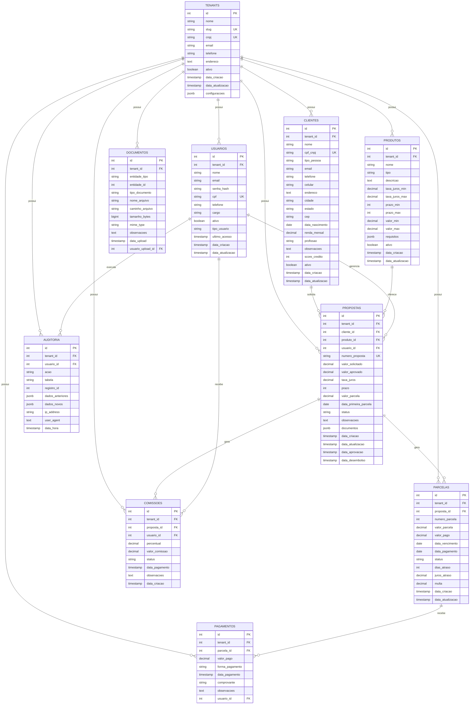

## Arquitetura Multi-Tenancy

### Estratégia: Schema Compartilhado com Tenant ID

**Características:**
- Todas as tabelas possuem `tenant_id` como Foreign Key para `tenants`
- Isolamento lógico através de filtros nas queries
- Índices compostos otimizados: `(tenant_id, campo_principal)`
- Cascade delete: Deletar tenant remove todos os dados relacionados

**Fluxo de Dados:**

1. **Tenant** (Organização)
   - Ponto central da arquitetura
   - Todos os dados pertencem a um tenant
   - Configurações globais em JSONB

2. **Usuários**
   - Vinculados a um tenant
   - Gerenciam propostas e clientes
   - Autenticação e autorização por tenant

3. **Clientes**
   - Pessoas físicas ou jurídicas
   - Vinculados a um tenant
   - Podem ter múltiplas propostas

4. **Propostas**
   - Solicitações de crédito
   - Vinculam cliente, produto e usuário
   - Geram parcelas quando aprovadas

5. **Parcelas**
   - Geradas automaticamente da proposta
   - Controlam vencimentos e pagamentos
   - Status: pendente, pago, atrasado

6. **Sistema de Comissões**
   - Calculadas sobre propostas aprovadas
   - Vinculadas a vendedores
   - Controle de pagamento

7. **Auditoria**
   - Log completo de todas as ações
   - Rastreabilidade para compliance
   - Dados antes/depois em JSONB

### Segurança

- **Isolamento**: Todas as queries filtram por `tenant_id`
- **Integridade**: Foreign Keys garantem consistência
- **Rastreabilidade**: Auditoria completa de ações
- **Soft Delete**: Marcação de inativos para preservar histórico
